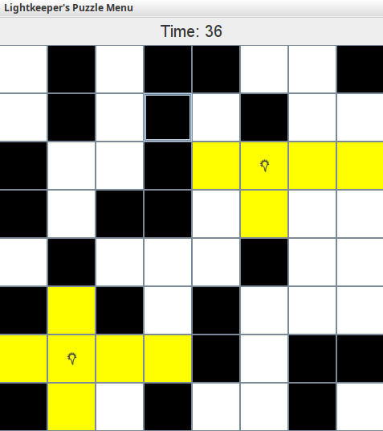

# Lightkeeper's Puzzle

This project is a simplified Akari (Light Up) game in Java using **Swing GUI components** I'm calling Lightkeeper's Puzzle. 
The objective of the game is to illuminate the entire grid of white cells while navigating around immovable black-cell walls
by placing lightbulbs to brighten a cell and project light outward in all four directions, stopping only when blocked by a wall. 
You win by positioning each lightbulb so that no white space remains in the dark and making sure they don't collide.

## Features
- Adjustable grid size
- Random wall generation
- Collision detection
- Save/Load game
- Win condition detection

## How to Run
- Make sure you have Java (JDK 25) installed
- Download the .jar file from the repo
- Run the game using **java -jar Lightkeeper's Puzzle.jar**

## Game Screenshot

